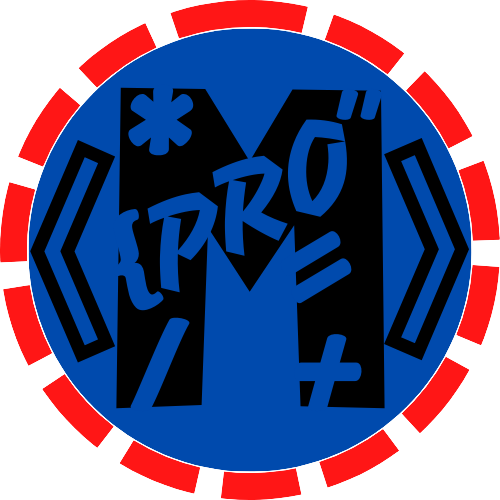

  

---

# Mis Apuntes de Programación Web

Bienvenido al Proyecto de Apuntes, donde encontrarás información detallada sobre diversos temas. Aquí encontrarás una recopilación de mis notas sobre HTML, CSS, JavaScript y muchas mas herramientas. Siéntete libre de explorar, contribuir y aprender junto a mí.  
 Este README te guiará a través de las características de Markdown utilizadas en este proyecto.

 # Indice

- [Mis Apuntes de Programación Web](#mis-apuntes-de-programación-web)
- [Indice](#indice)
  - [Sobre el Proyecto](#sobre-el-proyecto)
  - [Cómo Contribuir](#cómo-contribuir)
  - [Estructura del Repositorio](#estructura-del-repositorio)
    - [- **La terminal**](#--la-terminal)
    - [Contenido Destacado:](#contenido-destacado)
    - [- **tema 2**:](#--tema-2)
    - [- **tema 2**:](#--tema-2-1)
    - [- **tema 2**:](#--tema-2-2)
  - [Sobre el Autor](#sobre-el-autor)
  - [Licencia](#licencia)

 ## Sobre el Proyecto

Este proyecto tiene como objetivo proporcionar apuntes claros y concisos sobre diversos temas, desde programación hasta ciencias y más. Siéntete libre de contribuir y mejorar la calidad de los apuntes.

## Cómo Contribuir

Si encuentras errores, tienes sugerencias o quieres contribuir con nuevos apuntes, ¡tu ayuda es bienvenida! Puedes hacerlo siguiendo estos pasos:

¡Contribuir es fácil! Simplemente sigue estos pasos:

1. Haz un fork del repositorio.
2. Crea una rama para tus contribuciones: `git checkout -b tu-nueva-funcionalidad`.
3. Realiza tus cambios y haz commit: `git commit -m 'Añade nueva funcionalidad'`.
4. Haz push a la rama: `git push origin tu-nueva-funcionalidad`.
5. Abre un pull request.

## Estructura del Repositorio

### - **[La terminal](Terminal/Terminaldecomandos.md)**
Bienvenido a los Apuntes de Terminal
¡Hola y bienvenidos a esta guía completa de comandos y trucos de la terminal! Aquí, exploraremos el fascinante mundo de la interfaz de línea de comandos, una herramienta poderosa que te permite interactuar con tu computadora a través de comandos de texto..
### Contenido Destacado:
- Comandos Básicos: Desde navegar por directorios hasta la gestión de archivos y directorios.
- Trucos Avanzados: Alias, atajos, y otros consejos para mejorar tu flujo de trabajo.
- Personalización: Aprende a personalizar tu entorno de línea de comandos para que se adapte a tus necesidades.

### - **[tema 2](css/README.md)**: 
Información acerca de hojas de estilo en cascada, vital para el diseño y la presentación de páginas web.

### - **[tema 2](css/README.md)**: 
Información acerca de hojas de estilo en cascada, vital para el diseño y la presentación de páginas web.
### - **[tema 2](css/README.md)**: 
Información acerca de hojas de estilo en cascada, vital para el diseño y la presentación de páginas web.

## Sobre el Autor

Hola, soy [Tu claudio ortiz], un apasionado de la programación web. Este repositorio es mi espacio para compartir y aprender. ¡Espero que encuentres útiles estos apuntes!

## Licencia

Este proyecto está bajo la licencia [MIT](LICENSE). Siéntete libre de utilizar este contenido como desees.

---

**¡Gracias por visitar mi repositorio! Si tienes alguna pregunta o sugerencia, no dudes en [contactarme](mailto:ortizinbox1@gmail.com).**

  

